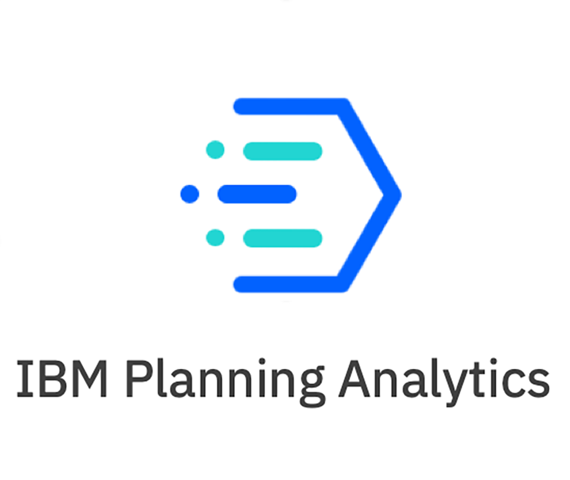

	
	 
	 
	 

<h1 align="center">
	Awesome TM1 Planning Analytics
</h1>

 

> Probably the best curated list of TM1 Planning Analytics

## Contents
* [Best Practice](#best-practice)

## Best Practice

## Tutorials

## Snippets Code

## Open-source Toolboxes

## Resources

### presentations
  
### podcasts
 
### books
  
### blogs
  
## Socialize

### Discord Community
  
### blogger

### Twitter Accounts

### YTB Accounts
  
### FB Accounts
  

  

